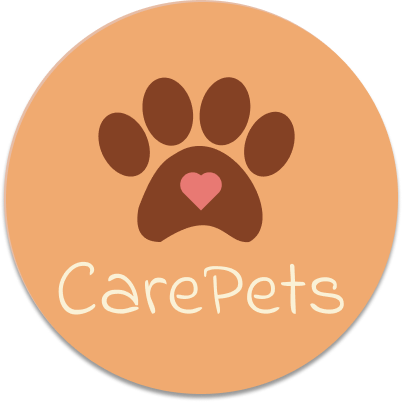
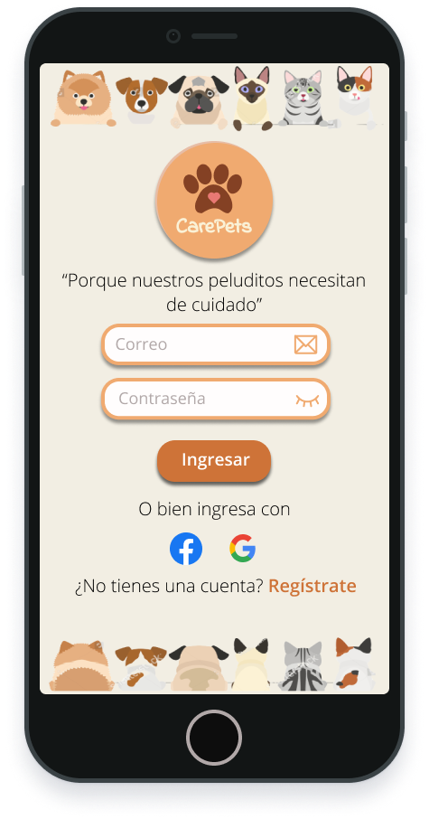
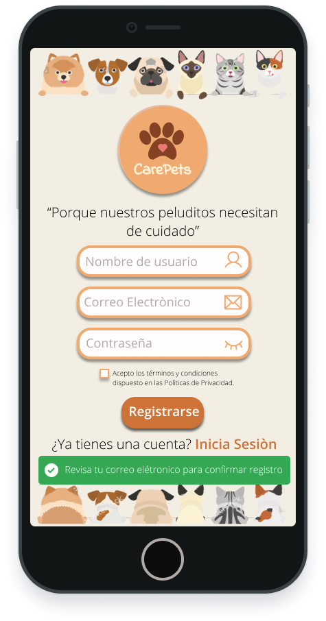
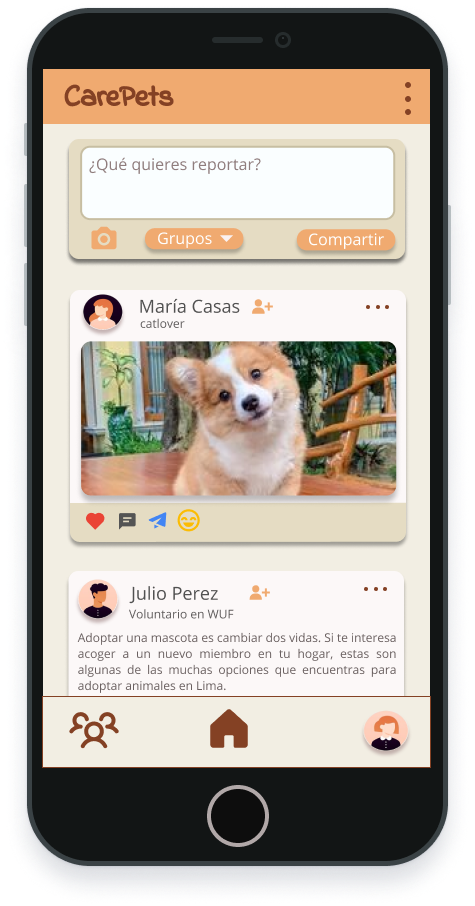

# CarePets 
## 1. Introducción 🚀

La industria de las redes sociales está en constante crecimiento y desarrollo. Las amamos u odiamos, y muchos no podemos vivir sin ellas. Por lo que, queremos presentarles a CarePets, una red social de información sobre mascotas que promueve la ayuda hacia ellos, cuyo propósito es permitir que los usuarios puedan informarse o compartir contenido relacionado a las necesidades de sus mascotas. Además de ser una plataforma de ayuda para aquellos animalitos que están desamparados o instituciones que atiendan dichos casos. Donde encontrarás grupos como **refugios, mascotas perdidas, adoptar, lugares de donación, entre otros.**

## 2. Resumen del proyecto 📋
Este proyecto tiene como finalidad **construir una Single Page Aplication**, dirigido a personas que necesitan información sobre mascotas. Permite a cualquier usuario crear una cuenta de acceso y loguearse con ella; crear, editar, borrar y _"likear"_ publicaciones. Tener un muro personal con sus propias publicaciones y un muro general en la que se puede seguir las últimas actualizaciones en los grupos. Además, de la zona de perfil, que permite al usuario actualizar sus datos como nombre de usuario, correo electrónico, una breve biografía/descripción y foto de perfil.

## 3. Descripción del proyecto  📎

#### ¿Cuál es la necesidad o el problema que CarePets busca solucionar?
CarePets está pensada en relación a la problemática de los abandonos y la adopción ilegal, lo que hace de ella una plataforma donde las organizaciones pueden realizar de forma gratuita llamamientos para la adopción y para la protección de nuestras mascotas.
#### ¿Para quién está diseñado CarePets exactamente?
Está diseñado para aquellas personas que buscan una aplicación para ponerse en contacto y conectar con aquellas personas que son amantes de los animales y que su mascota es su mejor amigo.
#### ¿Cómo CarePets está resolviendo los problemas de los usuarios?
Resuelve los problemas permitiendo a los usuarios publicar y compartir imágenes, actividades y anuncios de todo tipo, además que puedes encontrar los datos como correo electrónico para una comunicación personal con otros usuarios.
### 3.1. Proceso creativo de diseño ⚙️

_Nos brindaron el layout (diseño) de la vista mobile y desktop que debíamos replicar visualmente_
* Vista mobile

    

* Vista Desktop

    

_Por otro lado, se dejo a criterio nuestro la elección contenido, colores y fuentes de texto. Se realizaron los prototipos en [Figma](https://www.figma.com/file/94NnPGItEgvVlAq0mFJEKt/3er-project-REDSOCIAL?node-id=103:71)._
* Vista mobile 📲
 
 
 

* Vista Desktop 💻
 
 
 
### 3.2. Historias de Usuario y Criterios de Aceptación  📢  📝
#### SPRINT 1
```
HU 1:  🗣️ Yo COMO usuario QUIERO poder visualizar la página principal donde me permite registrarme en la aplicación PARA ingresar a la comunidad interesada en brindar o asistir ayuda a las mascotas.

 📍 **Criterios de Aceptación:**
Que se pueda diferenciar las áreas o secciones de la interfaz con facilidad, en este caso la opción de ingresar y la opción para registrarse. 
```

```
HU 2:  🗣️ Yo COMO usuario QUIERO tener diversas opciones de ingreso en la plataforma como facebook o google, además del ingreso por correo PARA que el proceso de ingreso sea más rápido y a elección del usuario.

 📍 **Criterios de Aceptación:**
Que el usuario al acceder a la plataforma pueda encontrar distintas maneras de registro e ingreso que faciliten el proceso.
```

```
HU 3:  🗣️ Yo COMO usuario QUIERO poder registrarme con correo y nombre de usuario PARA poder tener una credencial más personal al momento de ingresar a la plataforma.

 📍 **Criterios de Aceptación:**
Crear una sección donde el usuario pueda ingresar sus datos de correo, contraseña y nombre de usuario para hacer un registro más personalizado.
```

#### SPRINT 2
```
HU 1:  🗣️ Yo COMO usuario QUIERO crear una cuenta para iniciar sesión en CarePets PARA acceder a la red social.

 📍 **Criterios de Aceptación:**
- El usuario puede registrarse e ingresar con su usuario y contraseña.
- El usuario puede ingresar con cuenta de google.
```

```
HU 2:  🗣️ Yo COMO usuario QUIERO verificar por mensaje electronico mi cuenta en CarePets PARA garantizar que me registré con correo electrónico correctamente.

 📍 **Criterios de Aceptación:**
- Se permite el acceso a usuarios con cuentas válidas.
- No pueden haber usuarios repetidos.
- Al enviarse el formulario de registro, debe validarse.
```

```
HU 3:  🗣️ Yo COMO usuario QUIERO ver si hay errores a la hora de registrarme o iniciar sesión PARA que pueda ayudarme a corregirlos.

 📍 **Criterios de Aceptación:**
Si hay errores, se deben mostrar mensajes descriptivos para ayudar al usuario a corregirlos.
```

```
HU 4:  🗣️ Yo COMO usuario QUIERO poder cerrar sesión PARA poder proteger mis datos.

 📍 **Criterios de Aceptación:**
- El usuario puede cerrar sesión.
- La web recuerda y reconoce el estado del usuario al ingresar a la aplicación.
```

#### SPRINT 3
```
HU 1:  🗣️ Yo COMO usuario QUIERO crear, editar y borrar contenido de las publicaciones PARA compartir y aportar contenido en la red social.

 📍 **Criterios de Aceptación:**
- El usuario puede crear contenido.
- El usuario puede publicar varias veces.
- El usuario puede editar su publicación.
- El usuario puede eliminar su publicación.
```

```
HU 2:  🗣️ Yo COMO usuario QUIERO dar y quitar like a las publicaciones PARA dar una opinión positiva o de interés a los contenidos de las publicaciones de esta forma conectar con aquello que me interesa.

 📍 **Criterios de Aceptación:**
- El usuario puede darle like a su publicación y/o a otras publicaciones.
- El usuario puede quitarle like a su publicación y/o a otras publicaciones.
- El usuario puede ver sus likes así como de otros.
```

```
HU 3:  🗣️ Yo COMO usuario QUIERO ver los distintos grupos de la red social PARA ver las publicaciones y ver cual me interesa más.

 📍 **Criterios de Aceptación:**
- El usuario puede acceder a los grupos y ver las publicaciones hechas en la categoría respectiva.
- El usuario puede retornar al inicio y ver el muro general.
```

```
HU 4:  🗣️ Yo COMO usuario QUIERO ver mis propias publicaciones PARA actualizarlas y aportar nuevas noticias a la aplicación.

 📍 **Criterios de Aceptación:**
- El usuario puede acceder a sus publicaciones en una sola vista.
- El usuario puede editar y eliminar sus propias publicaciones.
- El usuario puede retornar al inicio y ver el muro general.
```

```
HU 5:  🗣️ Yo COMO usuario QUIERO publicar imágenes PARA incluir un contenido más práctico y detallado.

 📍 **Criterios de Aceptación:**
El usuario puede compartir imágenes y texto o por separado.
```

```
HU 6:  🗣️ Yo COMO usuario QUIERO actualizar mis datos de perfil PARA mantener mejor contacto con otros usuarios.

 📍 **Criterios de Aceptación:**
El usuario puede actualizar sus datos como nombre de usuario, imagen de perfil, estado/descripción y ubicación.
```

#### SPRINT 4
```
HU 1:  🗣️ Yo COMO  QUIERO  PARA.

 📍 **Criterios de Aceptación:**
-
-
```
### 3.3. Test de usabilidad 🔧

_Gracias al feedback recibido por nuestras compañeras, se identificó que se debía establecer algunas mejoras en los siguientes aspectos:_

_Durante el primer sprint se utilizaron colores pasteles y fuente de texto no muy legible para una red social._

```
Se modificó los colores y elección de una fuente de texto más legible para los usuarios.
```

_Durante el segundo sprint se continuó con la vista inicio sesión y registro_

```
Se modificó inicio sesión lo que es la contraseña, en donde el usuario al hacer click al ícono de ojo puede ver su contraseña y al hacer nuevamente click ocultar su contraseña.
```

_Durante el tercer sprint se continuó con la vista muro/timeline_

```
Se modificó las proporciones de las secciones principales en el muro general. También, se modificó el input tipo text a un textarea para evitar el desborde del texto en la publicación y una mejor vista del menú derecho del header.
```

###  3.4. Despliegue 📦

_El despliegue fue realizado a través de GitHub Project y puede acceder a nuestra página desde aquí: [CarePets: app para mascotas](https://fio-azahuanche.github.io/LIM016-social-network/)_

## 4. Consideraciones Generales  🚨
* La lógica del proyecto está implementada completamente en JavaScript (ES6+), HTML y CSS.
*  Uso de [Firebase](https://console.firebase.google.com/), plataforma en la nube para el login y publicaciones de nuestra aplicación.
*  Uso de la librería [Jest](https://jestjs.io/docs/getting-started) para escribir y ejecutar tests.
* El tiempo del proyecto fue de  `4 semanas.`

### 4.1. Herramientas 🛠️

* La organización fue inicialmente en [Trello](https://trello.com/b/nhdNNFxa/red-social).
* Uso de [Google Drive](https://docs.google.com/document/d/16od4ZV9bH1KP6YRdJTN8LHoqHeoV4Z_FPOEvkIxRJuk/edit) para elección de temática.
* Se realizó el prototipo de la aplicación en [Figma](https://www.figma.com/file/94NnPGItEgvVlAq0mFJEKt/3er-project-REDSOCIAL?node-id=103:71).

_Puedes encontrar mucho más de nuestra organización [GitHub Project](https://github.com/fio-azahuanche/LIM016-social-network/projects/1)._

### 4.2. Versionado 📌

Usamos [Git](http://semver.org/) para el versionado. Para todas las versiones disponibles, mira los [tags en este repositorio](https://github.com/fio-azahuanche/LIM016-social-network/tags).

## 5. Autoras ✒️
Elaborado con 💛❤️ por:
- **Yumari Cruz** [yumari081196](https://github.com/Yumari081196)😊
- **Marielena Aizaga** [PandArtist93](https://github.com/PandArtist93)😊
- **Fiorela Azahuanche** [fio-azahuanche](https://github.com/fio-azahuanche) 😊

## 6. Objetivos de aprendizaje 📄
### HTML

- [x] **Uso de HTML semántico**

### CSS

- [x] **Uso de selectores de CSS**

- [x] **Modelo de caja (box model): borde, margen, padding**

- [x] **Uso de flexbox en CSS**

- [x] **Uso de CSS Grid Layout**

### Web APIs

- [x] **Uso de selectores del DOM**

- [x] **Manejo de eventos del DOM (listeners, propagación, delegación)**

- [x] **Manipulación dinámica del DOM**

- [x] **Ruteado (History API, evento hashchange, window.location)**

### JavaScript

- [x] **Arrays (arreglos)**

- [x] **Objetos (key, value)**

- [x] **Diferenciar entre tipos de datos primitivos y no primitivos**

- [x] **Variables (declaración, asignación, ámbito)**

- [x] **Uso de condicionales (if-else, switch, operador ternario, lógica booleana)**

- [x] **Uso de bucles/ciclos (while, for, for..of)**

- [x] **Funciones (params, args, return)**

- [ ] **Pruebas unitarias (unit tests)**

- [ ] **Pruebas asíncronas**

- [ ] **Uso de mocks y espías**

- [ ] **Módulos de ECMAScript (ES Modules)**

- [x] **Uso de linter (ESLINT)**

- [x] **Uso de identificadores descriptivos (Nomenclatura y Semántica)**

- [x] **Diferenciar entre expresiones (expressions) y sentencias (statements)**

- [x] **Callbacks**

- [x] **Promesas**

### Control de Versiones (Git y GitHub)

- [x] **Git: Instalación y configuración**

- [x] **Git: Control de versiones con git (init, clone, add, commit, status, push, pull, remote)**

- [x] **Git: Integración de cambios entre ramas (branch, checkout, fetch, merge, reset, rebase, tag)**

- [x] **GitHub: Creación de cuenta y repos, configuración de llaves SSH**

- [x] **GitHub: Despliegue con GitHub Pages**

- [x] **GitHub: Colaboración en Github (branches | forks | pull requests | code review | tags)**

- [x] **GitHub: Organización en Github (projects | issues | labels | milestones | releases)**

### UX (User eXperience)

- [x] **Diseñar la aplicación pensando en y entendiendo al usuario**

- [x] **Crear prototipos para obtener feedback e iterar**

- [x] **Aplicar los principios de diseño visual (contraste, alineación, jerarquía)**

- [x] **Planear y ejecutar tests de usabilidad**

### Firebase

- [x] **Firebase Auth**

- [x] **Firestore**